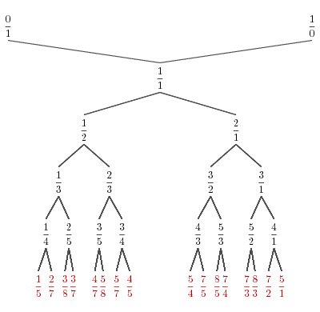
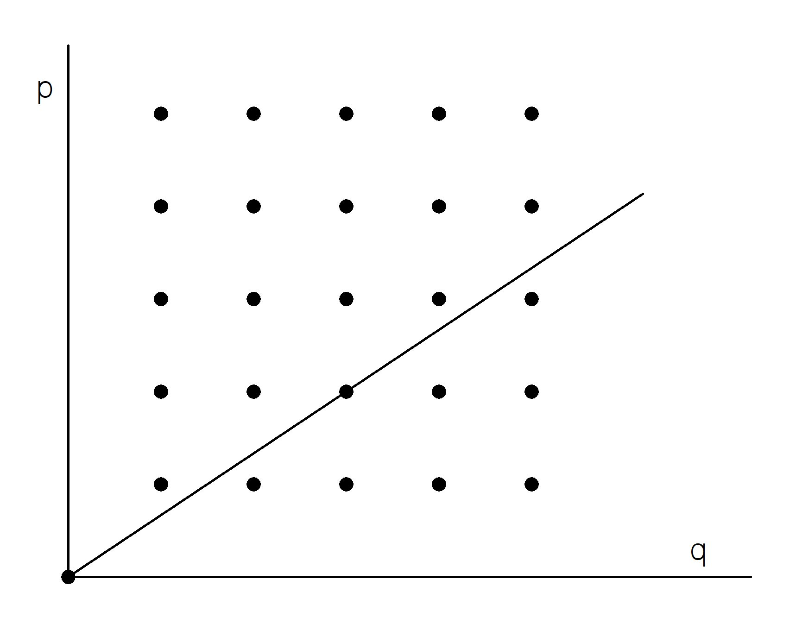
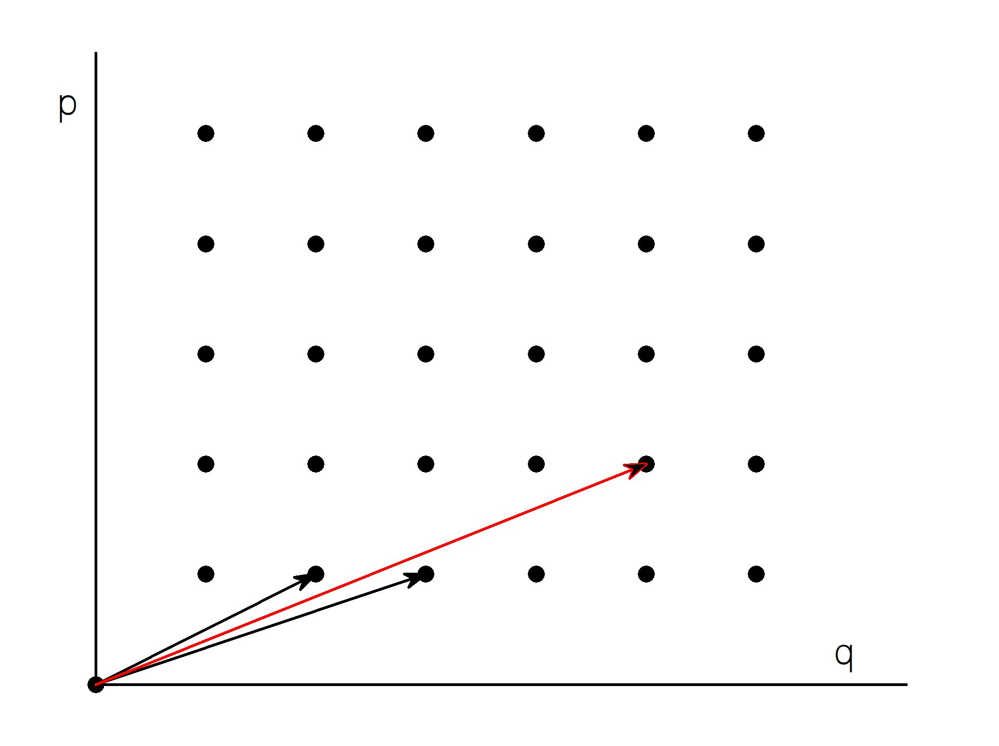

# Stern-Brocot Trees and Their Applications #

## Introduction ##
Sometimes, in some corners of math, you find things completely different from what you were looking for. This is what happened to an 19th century French clock-maker, Achilles Brocot who was looking for the best way to make geared wheels for his clocks and found the best rational approximation for irrational numbers. Why would this be of interest to you? Well, despite having floating point units in most processors these days, working with integer numbers sometimes has its advantages. In these cases its useful to know that you can approximate &pi; as 355/113 accurate to 7 decimal places. This particular piece of information you can get from Wikipedia but what if your algorithm requires something like ln(2) or &phi;.

You can find these answers using the tree structure discovered by Messrs Stern and Brocot. The first few levels of this tree are shown in the image below  
 

## Mathematical Background ##
If you are interested only in the programming details you can skip this part and go directly to the applications section.

Rational numbers are those numbers that can be expressed as a fraction p/q. As there are many fractions that represent the same rational number we will choose only the fraction where P and q don't have any common factors. For instance 2/3 and 4/6 represent the same number but we will choose only the first one. If we arrange the integer numbers on two axes, we can imagine rational numbers as the slope of the line from origin to the p/q point. The image below shows the representation of "2/3". 


We need to define now the concept of *mediant*: the mediant of two rational numbers m/n and m'/n' is the rational number (m+m')/(n+n'). Below are the numbers 1/2 and 1/3 and their mediant 2/5.
.
Looking at those numbers as a vector addition, it can be seen that the mediant of two numbers lies somewhere between them. In math terms, if m/n < m'/n' then m/n < (m+m')/(n+n') < m'/n';

We can now start building the Stern-Brocot tree. We start with the numbers 0/1 and 1/0. 1/0 is not technically a fraction but it's useful to consider it as a representation for "infinity".

On each successive level of the tree we add the mediants of the numbers on previous level. On level 2 we place the mediant of those numbers (0+1)/(1+0) = 1/1. On the next level we place the medaints of each of those numbers: (0+1)/(1+1) = 1/2 and (1+1)/(1+0) = 2/1.

Next image shows how successive levels of the tree expand to cover the grid of rational numbers.

Grayed out points are those where p and q have common factors.

We've seen how rational numbers can be seen as lines going through one of the points of the grid of integers. Irrational numbers can then be seen as lines that never quite hit one of the grid points. Finding an approximation translates into finding a grid point that is close enough.

## Application of Stern-Brocot trees for rational approximations ##
We've seen that our tree has on any level the mediants of the values on the previous level and that the value of a mediant is between the values of its ancestors. In such a tree searching for a good enough approximation for the number N with tolerance &epsilon; can be done with the following algorithm:

1. Let current node T be the root of the tree.
2. If |N-T| < &epsilon; exit and the answer is T
3. If N < T replace T with the left child of T otherwise replace T with the right child of T
4. Proceed to step 2
This algorithm, or better said the properties of Stern-Brocot tree, guaranties that the approximation p/q found is "best" in the sense that any other p'/q' approximation with the same precision will have p'>p and q'>q.
## Usage ##
The `sba` program computes the best rational approximation with a given precision. The command line is:
````
sba <number> <precision>
````
Here is an example calculating the approximation for &pi; with 7 decimal places:
 

## Implementation ##
Nothing fancy here! Each tree node is represented by a `sbnode` structure that contains the `p` and `q` values, left and right children and a pointer to the parent node.
````C++
struct sbnode {
  int p, q;
  struct sbnode *left, *right, *parent;
  sbnode (sbnode *parent_) 
  {
    p = q = 0; 
    left = right = 0; 
    parent = parent_;
  }
  ~sbnode () 
  {
    if (left)
      delete left;
    if (right)
      delete right;
  }
}
````
constructor and destructor functions take care of initializing the node and cleaning up at end.

The program implements the algorithm described before. However it doesn't create the tree beforehand. Instead, child nodes are created only when needed.

## Epilogue - the gears of time ##


After reading this story you might wonder why a clockmaker was interested in these trees. If two gears, one with *p* teeth and the other with *q* teeth are connected, their rotation ratio (gear ratio) is p/q.

Gears can be combined like in the following example of a double gear:  
  
In this case, if the gear ratio of the first couple (red/blue) is p1/q1 and the ratio of the second couple (yellow/green) is p2/q2, the combined gear ratio (red/green) is `p1/q1 * p2/q2`.

As an example of the problems clockmakers were having in the past, an 18th century clockmaker, Charles-Étienne-Louis Camus, presented the following problem: “To find the number of the teeth…of
the wheels and pinions of a machine, which being moved by a pinion, placed on the hour
wheel, shall cause a wheel to make a revolution in a mean year, supposed to consist of 365 days,
5 hours, 49 minutes”. If we work everything to minutes, the problem requires designing a gear train with the ratio 720/525949 (the hour wheel makes a complete rotation in 12 hours).

Building gears with 525949 teeth is hard to imagine and making compound gears in this case is hindered by the fact that 525949 is a prime number. Camus had to find a combination that was close to the required ratio but with numbers that factor nicely.

Our little `sba` utility provides an answer:
````
~sba 0.0013689540240594 10
Finding approximation of 0.0013689540 with 10 decimals
....
Current approximation 97/70857 = 0.0013690 (err=-3.49e-10)
Current approximation 130/94963 = 0.0013690 (err=-2.00e-10)
Current approximation 163/119069 = 0.0013690 (err=-1.12e-10)

Found fraction 196/143175 = 0.00136895408
Error= -5.31e-11
````
This number can be decomposed as `4/25 * 7/69 * 7/83`. It took Camus 20 pages of arduous work to get to the same result.

## References ##
[1] Graham, R. L., Knuth, D. E.,, Patashnik, O. (1994). Concrete Mathematics: A Foundation for Computer Science 2nd Edition. Reading: Addison-Wesley.  
[2] Wikipedia page for Stern-Brocot trees (https://en.wikipedia.org/wiki/Stern%E2%80%93Brocot_tree)  
[3] Wikipedia page for approximations of &pi; (https://en.wikipedia.org/wiki/Approximations_of_%CF%80)  
[4] Wikipedia page for gear train (https://en.wikipedia.org/wiki/Gear_train)  
[5] Brian Hayes, "On the Teeth of Wheels" in American Scientist, Vol. 88, No. 4, July-August 2000, pages 296-300.

